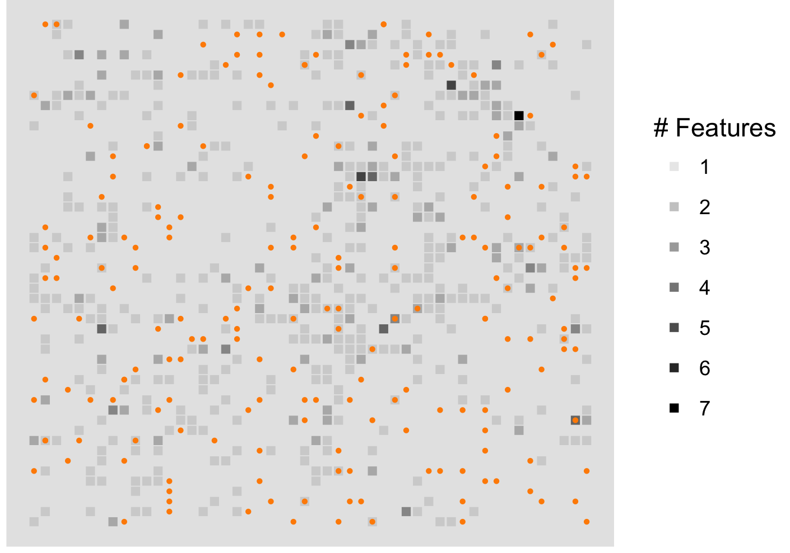
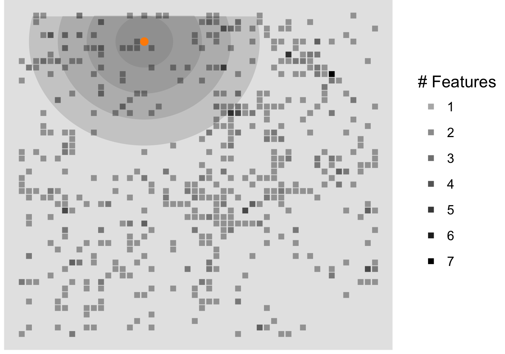
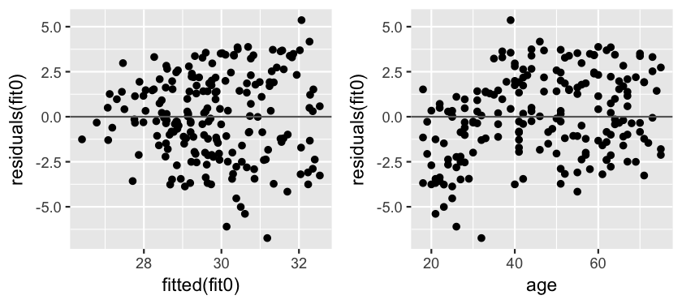
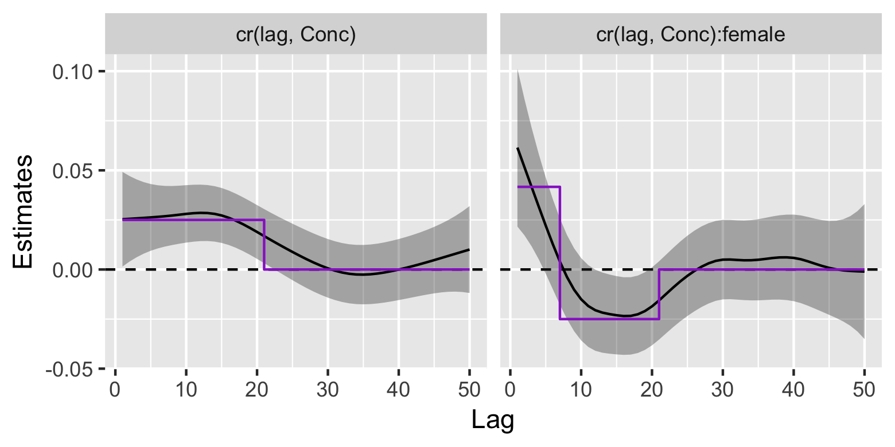

# An Introduction to the 'dlmBE' package

### Installation

To install the development version of the `dlmBE` package from GitHub,
we recommend running the following in R (version 3.0 or higher),

```R
if (!suppressWarnings (library(devtools, logical = TRUE)))
  install.packages ("devtools")
library (devtools)
install_github("Biostatistics4SocialImpact/dlm", dependencies = TRUE)
```

## Package Overview

The goal of this package is to provide researchers with a convenient interface
to fit and summarize distributed lag models (DLMs) using the R programming
language. DLMs are useful when users want to model an outcome that is related to
distance-profiled predictors through some unknown smooth function.
A typical goal could then be to
learn about the shape of that distance-profiled response function. For
example, this type of model might be applied when a researcher wants to learn:

 - (Epidemiology) the relationship between health outcomes and proximity of
   subjects to certain environmental features
 - (Cognitive Neuroscience) the shape of the blood-oxygen response
   in the time following some sort of stimulus in functional MR images of the
   brain
 - (Genetics) the probability of gene expression or presence as a function of
   neighboring gene expression/presence

And many more. For the purposes of this walk-through, we will focus on just
one type of example from our own past research: health outcomes and
subjects' proximity to features of the built environment
(Baek, J, *et al*, 2016, 2017).

We simulate data on a (50 x 50) grid representing an imaginary cityscape.
Within our city we simulate a number of built environment features with a
mild spatial correlation, and *N* = 200 subjects with homes distributed
uniformly over our plot of land. We have data in the form of (*x*, *y*)
coordinate pairs for each subject and environmental feature, and descriptive
information about the gender and age of each subject.




_Simulated features of the built environment. Each gray cube represents the
location(s) of one or more environment features. Each orange dot
represents a participant location._

```R
## (x, y) positions for subjects
> head(subj.xy)
   x  y
1 18 46
2 46 47
3 27 22
4 28 26
5 45 19
6 47 48

## (x, y) positions for BE features
> head(feat.xy)
   x y
1  1 1
2  8 1
3  8 1
4 31 1
5 37 1
6 38 1

> head(data.frame(y, female, age))
         y female age
1 31.95842      1  46
2 24.91282      0  65
3 30.95102      1  55
4 33.12025      0  64
5 32.72775      1  26
6 27.27995      1  30

> table(female)
female
  0   1
 99 101

> summary(age)
   Min. 1st Qu.  Median    Mean 3rd Qu.    Max.
  18.00   32.00   47.00   46.56   61.00   75.00
```

We're interested in the case where the features we've built into our cityscape
have some average measurable impact on participant outcomes, but this impact
changes as a function of distance. Imagine each "feature" is, say, a fast-food
restaurant and we want to learn about what kind of effect living near this
type of convenience has on subjects' body-mass index (BMI). One analytical
approach could be to count how many restaurants are within a given radial
distance of each subject's home and include that count in a regression model
as a predictor of our outcome (BMI; `y`).




_Same environment as above, but focused on the first participant in our
data set and the number of features within some units of her home. Radii shown
are 4, 8, 12, and 16 units._


In practice, we probably don't often know the appropriate radius to pick for
this type of problem (or if different sub-populations react differently over
different radii, etc.) although extant literature or domain-specific knowledge
may lead us to a few reasonable guesses. The DLM framework provides an
alternative solution to this type of problem when the analyst is comfortable
making the extra assumption that the underlying function of distance is
continuous, or approximately so. In this example, DLMs free the user from
the responsibility of selecting a single radius or distance-threshold.
Instead, the analyst can input many radii and rely on the DLM to infer
the shape of a continuous function that links them all.

Although there are multiple different options to allow users to estimate
arbitrary functions of distance, we focus on the use of splines as a
flexible and interpretable semi-parametric method.
Our implementation in the `dlmBE` package relies on the `lme4`
package to penalize the spline terms using mixed effects modeling and
provide numerically stable results, even for large numbers of radii.


## Fitting and interpreting DL models

Analysis of this type of data may proceed as follows. 
We begin by computing, for each participant, the radial distance to each
environmental feature. In the `count.features()` function below, `xy` should
be a 2-element (*x*, *y*) vector for a single subject location, `feature.xy`
is a 2-column matrix of feature locations (following the `feat.xy` variable
above), and `radii` is a vector of desired radii to measure and count
features between.
We follow our prior work and count the total number
of features at each available distance on the (50 x 50) grid. In general,
we advocate an analysis strategy of starting simple and gradually allowing
for more complexity, so we fit an initial model with only one DL function
of distance and number of fast-food locations. A DL term can be included
in model formulas with the **`cr()`** function which constructs a cubic radial
smoothing spline basis for the lag radii. Then we use the **`dlm()`** function
to fit the model like any other regression in R.

```R
## count.features - a function to count the number of features between radii
## centered on a subject's location, xy. Feature locations should be given
## in matrix form in feature.xy
count.features <- function(xy, feature.xy, radii) {
  .dist <- function(x) sqrt(sum(x^2))  # Euclidean distance
  dxy <- apply(sweep(feature.xy, 2, xy), 1, .dist)
  table(cut(dxy, radii, include.lowest = TRUE))
}

lag <- 1:50  # each available radius

## count of features for each subject (row) and radius (column)
Conc <- t(apply(subj.xy, 1, count.features,
                feature.xy = feat.xy, radii = c(0, lag)))
				
## > Conc[1:10, 1:5]
##       [0,1] (1,2] (2,3] (3,4] (4,5]
##  [1,]     0     0     4     4     8
##  [2,]     0     1     3     3    11
##  [3,]     1     0     2     9     7
##  [4,]     1     1     0     1     4
##  [5,]     1     2     9     5    13
##  [6,]     0     1     0     1     5
##  [7,]     0     3     0     2     6
##  [8,]     1     0     0     1     6
##  [9,]     0     1     2     4     9
## [10,]     0     3     3     3     6

## basic model--only DL term
fit0 <- dlm(y ~ cr(lag, Conc))
```

Standard `summary()` methods are available for **`dlMod`** objects
(the output type of the **`dlm()`** function), but the printout is designed
mostly for easy interpretation of fixed effects covariates. 

```R
> summary(fit0)
Linear mixed model fit by REML ['dlMod']
Formula: y ~ cr(lag, Conc)

REML criterion at convergence: 936.7

Scaled residuals:
     Min       1Q   Median       3Q      Max
-2.85065 -0.68897  0.00298  0.78527  2.26968

Random effects:
 Groups        Name   Variance  Std.Dev.
 cr(lag, Conc) (mean) 1.013e-08 0.0001007
 Residual             5.584e+00 2.3630757
Number of obs: 200, groups:  cr(lag, Conc), 48

Fixed effects:
            Estimate Std. Error t value
(Intercept)   24.069      6.731   3.576

Correlation of Fixed Effects:
<0 x 0 matrix>
```

It's more informative, however, to explore model summaries graphically.
`dlmBE` uses the `ggplot2` package for its default plotting methods, so
we continue in that vein for exploratory and diagnostic data
visualization.

```R
## Examine residuals plot
qplot(fitted(fit0), residuals(fit0)) +
  geom_hline(yintercept = 0, col = "gray40")
```



_Quick residual diagnostics for the model with only one DL function.
There appears to be a non-constant variance pattern, and age and gender
are clearly correlated with the residuals from this fit. The code below
produces the plot on the left._


The residual plots above suggest a few problems with the fit of this simple
model. At minimum, it appears we should also be controlling for effects
of age and gender in this analysis. In particular, it looks like the relationship
between age and BMI may be quadratic (since these data are synthetic, we know
this is not actually the correct generating function, but here it provides
a reasonable approximation). For exploratory purposes, we'll compare the fits
of two additional models: one including gender and a quadratic function of age
(we'll create the variable `c.age`, which is mean-centered), and the other
building further to allow the function of distance to be different for
men and women in our sample.

```R
## Model including a function of age and gender
fit1 <- dlm(y ~ c.age + I(c.age^2) + female + cr(lag, Conc))

## Model including interaction between DL term and gender
fit2 <- dlm(y ~ c.age + I(c.age^2) + cr(lag, Conc) * female)
```

Since the models are all nested, we can conveniently compare the fits of each
against one another using the `anova()` function (inherited from `lme4`; note
the automatic conversion to maximum-likelihood).

```R
> anova(fit0, fit1, fit2)
refitting model(s) with ML (instead of REML)
Data: NULL
Models:
fit0: y ~ cr(lag, Conc)
fit1: y ~ c.age + I(c.age^2) + female + cr(lag, Conc)
fit2: y ~ c.age + I(c.age^2) + cr(lag, Conc) * female
     Df    AIC    BIC  logLik deviance   Chisq Chi Df Pr(>Chisq)
fit0  5 923.08 939.57 -456.54   913.08
fit1  8 678.46 704.85 -331.23   662.46 250.613      3  < 2.2e-16 ***
fit2 11 618.79 655.07 -298.39   596.79  65.675      3  3.597e-14 ***
---
Signif. codes:  0 '***' 0.001 '**' 0.01 '*' 0.05 '.' 0.1 ' ' 1
```

The fairly dramatic jumps in the likelihood statistics indicate substantial
improvements in the fit of each model, moving from `fit0` &rarr; `fit1`
&rarr; `fit2`. We also compared `fit0` \& `fit1` with a model that included
a `cr(lag, Conc) * c.age` term (instead of `cr(lag, Conc) * female`; not shown),
and found that this did not significantly improve the likelihood over `fit1`.
In addition, residual diagnostics (also not shown) do not indicate any major
problems with `fit2`, building further confidence in this model.
Given these results, we proceed to draw inference from `fit2` (which at this
point is very close to the data generating model).

```R
> summary(fit2)
Linear mixed model fit by REML ['dlMod']
Formula: y ~ c.age + I(c.age^2) + cr(lag, Conc) * female

REML criterion at convergence: 643.5

Scaled residuals:
    Min      1Q  Median      3Q     Max
-2.7007 -0.6195  0.0142  0.5842  2.6054

Random effects:
 Groups               Name   Variance  Std.Dev.
 cr(lag, Conc)        (mean) 3.590e-08 0.0001895
 cr(lag, Conc):female (mean) 2.739e-07 0.0005234
 Residual                    9.034e-01 0.9504623
Number of obs: 200, groups:  cr(lag, Conc), 48; cr(lag, Conc):female, 48

Fixed effects:
              Estimate Std. Error t value
(Intercept) 25.3594917  4.1286840   6.142
c.age        0.0402336  0.0043124   9.330
I(c.age^2)  -0.0027182  0.0002922  -9.302
female      -0.9406013  5.6451103  -0.167

Correlation of Fixed Effects:
           (Intr) c.age  I(.^2)
c.age       0.051
I(c.age^2) -0.099  0.043
female     -0.727 -0.024  0.066
```

This model suggests that, on average, women have slightly lower BMI than men
in this sample, and that they respond differently to proximity to fast-food
restaurants. There also appears to be a strong effect of BMI increasing with
age that tapers off for older age groups.

Not losing sight of our primary goal,
before we finish with this example, let's summarize the fitted DL functions
and check how they stack up against the true ones (there were in fact different
response functions for men and women in this simulation).
`dlmBE` provides a few convenient utilities to extract and visualize estimated
DL coefficients in a fitted model. For visualization, the basic syntax is simply
`plot(fit2)`, but the call below enriches the plot with the addition of the true
DL functions in purple (note the use of a "`term`" factor in the data for these
functions to get them to render properly on the plot facets).



_Estimated distributed lag functions for the model_ `fit2`_. Given the model
specification, the plot on the left shows the response in expected BMI at each
radial distance for men, and the plot on the right shows the effect for
women_ minus _the effect for men (since the terms are additive). Although
the true DL functions are discontinuous step functions in this example,
the smoothing splines do a reasonable job of recovering approximately correct
shapes._

```R
plot(fit2, geom = "line") +
  geom_step(aes(x, y),
    data = data.frame(x = lag, y = c(theta1, theta2 - theta1),
      term = rep(names(fit2@index), each = length(lag))),
    color = "darkorchid")
```

The model estimates mild effects of dwelling proximity to fast-food on BMI;
based on 95% confidence intervals (the default), these effects may go to zero
after about 20 distance units in men, and maybe 5-10 distance units in women.
The exact points where the confidence intervals are about to cross the zero
line can be extracted with the **`changePoint()`** utility. Finally, we also show
how to compute confidence intervals using the familiar `confint()`, and extract
DL term-specific parameters using combinations of the **`lagIndex()`**,
**`vcoef()`**,
and **`Sigma()`** methods.

```R
> changePoint(fit2)
$`cr(lag, Conc)`
cr(lag, Conc)22
             22

$`cr(lag, Conc):female`
 cr(lag, Conc):female4 cr(lag, Conc):female19
                     4                     19

> confint(fit2)
                                coef          2.5%         97.5%
(Intercept)             2.535949e+01  17.267419810  3.345156e+01
c.age                   4.023355e-02   0.031781470  4.868563e-02
I(c.age^2)             -2.718213e-03  -0.003290942 -2.145484e-03
cr(lag, Conc)1          2.534196e-02   0.001469709  4.921420e-02
cr(lag, Conc)2          2.556467e-02   0.003988527  4.714081e-02
female                 -9.406013e-01 -12.004814066  1.012361e+01
cr(lag, Conc)1:female   6.147205e-02   0.021652154  1.012920e-01
cr(lag, Conc)2:female   5.155791e-02   0.017206960  8.590887e-02
cr(lag, Conc)3          2.578794e-02   0.006160107  4.541578e-02
cr(lag, Conc)4          2.602213e-02   0.007979825  4.406444e-02
...

> lg.ind <- lagIndex(fit2)  # integer index list for DL coefs
> vcoef(fit2)[lg.ind[[1]]]  # term 1 lag coefs
 cr(lag, Conc)1  cr(lag, Conc)2  cr(lag, Conc)3  cr(lag, Conc)4  cr(lag, Conc)5
   2.534196e-02    2.556467e-02    2.578794e-02    2.602213e-02    2.627490e-02
...

> sqrt(diag(Sigma(fit2)[lg.ind[[1]], lg.ind[[1]]])) # SE's of term1 DL coefs
 [1] 0.012179942 0.011008437 0.010014386 0.009205428 0.008578863
...
```


## References
Baek J, Sanchez BN, Berrocal VJ, & Sanchez-Vaznaugh EV (2016) Epidemiology
27(1):116-24. ([PubMed](https://www.ncbi.nlm.nih.gov/pubmed/26414942))

Baek J, Hirsch JA, Moore K, Tabb LP, et al. (2017) Epidemiology 28(3):403-11.
([PubMed](https://www.ncbi.nlm.nih.gov/pubmed/28145983))
